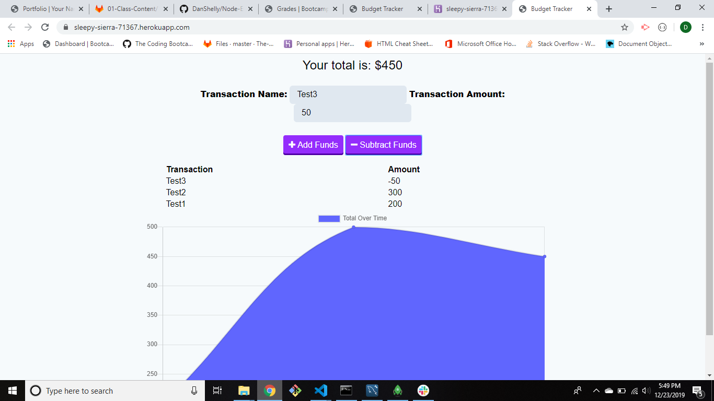

# Progressive-Budget

## Description
This application allows users to track their budget by adding or subtracting funds.

## Functionality
The user is able to add funds to the database with a button after filling out the name and amount in the input fields,and similarly can subtract funds using the same method. A line graph is updated live as the information is added or subtracted from the database.

## Screenshot

## Links
https://sleepy-sierra-71367.herokuapp.com/